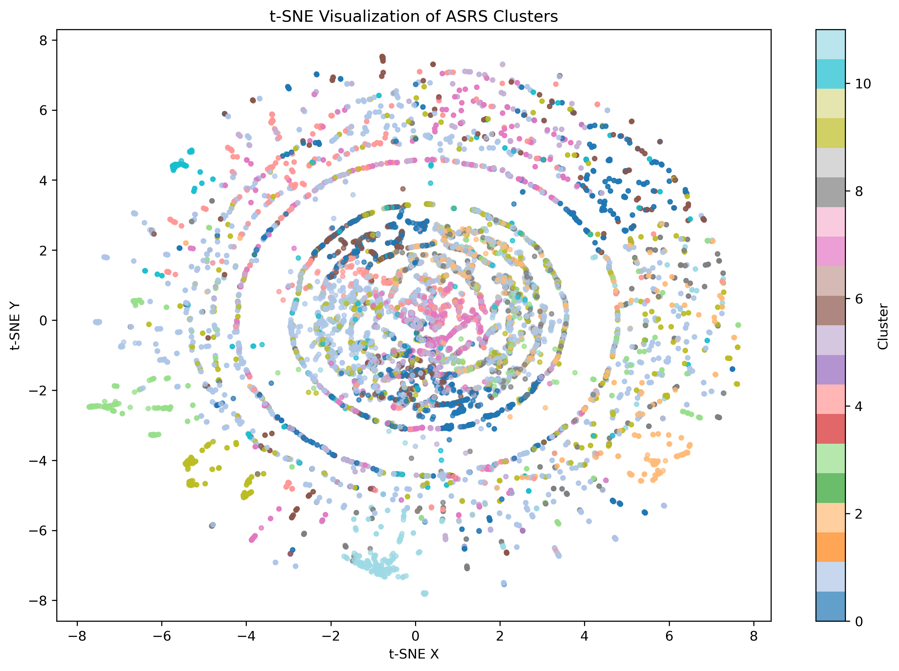

# 📘 ASRS Aviation Safety Intelligence Pipeline
A structured, reproducible workflow for transforming raw ASRS incident reports into a clean dataset and LLM‑derived safety intelligence.

Overview
This project builds a complete data pipeline for the FAA/NASA Aviation Safety Reporting System (ASRS).
The workflow ingests raw multi‑header CSVs, cleans and normalizes the dataset, and prepares it for downstream LLM‑based extraction of causal chains, human‑factor indicators, and operational risk signals.

The goal is to convert unstructured safety narratives into structured, analyzable intelligence.

# 📊 Cluster Visualization (t‑SNE)

To understand the structure of the 16,535 ASRS narratives, I applied t‑SNE to the TF‑IDF matrix and colored each point by its assigned cluster. The result is a circular, high‑density visualization that reveals clear thematic separation between incident types.

This plot demonstrates:

- strong cluster cohesion  
- distinct operational themes  
- meaningful separation between narrative patterns  
- a visually interpretable structure in high‑dimensional text data  



# 📂 Project Structure
```
project/
│
├── data/
│   ├── raw/                # Original ASRS CSVs (multi-header, malformed rows)
│   ├── interim/            # Merged dataset after ingestion
│   └── processed/          # Cleaned dataset ready for LLM extraction
│
├── notebooks/
│   ├── 01_exploration.ipynb   # Ingestion, header correction, merge
│   ├── 02_cleaning.ipynb      # Text cleaning, normalization, preprocessing
│   └── 03_llm_extraction.ipynb# Structured extraction (causal chains, HFACS, risk)
│
└── README.md
```
# 🛠️ Pipeline Summary
## 1. Ingestion & Exploration (01_exploration.ipynb)
Handles ASRS’s two‑row header structure

Skips malformed rows safely

Normalizes column names

Merges six ASRS datasets into one

Saves asrs_merged_3yrs.csv

Key challenges solved:

Multi‑header CSVs

Duplicate section labels

Misaligned columns

Corrupted header rows

## 2. Cleaning & Normalization (02_cleaning.ipynb)
Cleans narrative text (UTF‑8 normalization, whitespace collapse)

Normalizes date fields (YYYYMM → YYYY‑MM)

Converts time‑of‑day buckets into categorical labels

Strips whitespace from location fields

Saves asrs_cleaned_3yrs.csv

This notebook produces a stable, analysis‑ready dataset.

## 3. LLM Extraction (03_llm_extraction.ipynb)
(Next step)

Builds extraction schema

Uses LLMs to derive structured fields from narratives

Generates causal chains

Identifies human‑factor indicators

Extracts operational risk signals

Saves enriched dataset

This is where the dataset becomes an aviation safety intelligence system.

# 📦 Installation
```
pip install pandas numpy
```
Optional (for LLM extraction):

```
pip install openai tiktoken
```
# ▶️ Usage
Place raw ASRS CSVs into data/raw/

Run 01_exploration.ipynb

Run 02_cleaning.ipynb

Run 03_llm_extraction.ipynb

Use the enriched dataset for analysis, modeling, or visualization

# 📈 Future Work
HFACS classification

Risk scoring models

Narrative embeddings

Clustering of incident types

Dashboard for safety trend visualization

# ✈️ Purpose
ASRS narratives contain some of the richest human‑factor and operational risk data in aviation.
This pipeline transforms them into structured intelligence suitable for:

safety analysis

risk modeling

operational decision support

research

automation workflows